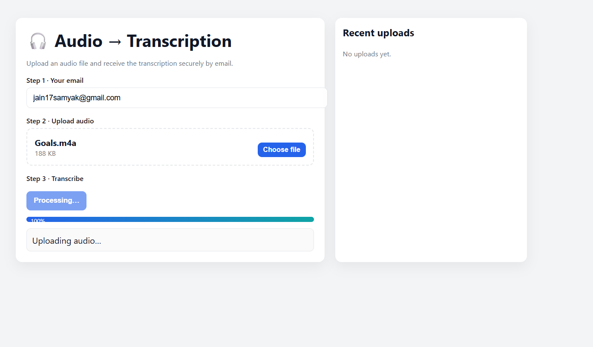

# 🎧 Audio → Transcription  
### End-to-End AI Audio Transcription with Email Delivery

A full-stack application that allows users to upload audio files, transcribe speech using AI (Whisper), and receive the transcription securely via email.

This project demonstrates **real-world system design**, not just a demo:
- Frontend UI
- Backend API
- AI model inference
- Email automation
- Cloud-ready architecture

---

##  Live Overview (UI Walkthrough)

### 1️⃣ Upload Audio
Users enter their email and upload an audio file (MP3 / WAV / M4A).

---

### 2️⃣ Processing & Transcription
The file is sent to the backend, processed using an AI speech-to-text model, and queued for delivery.

---

### 3️⃣ Email Delivery & History
Once completed, the transcription is emailed to the user.  
Recent uploads are tracked in the UI.

---

##  How It Works (Architecture)

- The frontend handles file uploads and UX
- The backend processes audio using Whisper
- Transcriptions are emailed automatically
- No audio is stored permanently

---

##  Features

-  Drag & drop audio upload
-  Email-based delivery of transcription
-  AI-powered speech recognition (Whisper)
-  Upload history tracking
-  Secure handling of files
-  Responsive, clean UI

---

##  Tech Stack

### Frontend
- React
- Vite
- CSS (custom, no UI frameworks)

### Backend
- FastAPI
- OpenAI Whisper
- Uvicorn
- Python

### Other
- SMTP (email automation)
- REST APIs
- Environment-based configuration

